# Doofenshmirtz Evil Inc policy RAG

A question-answering tool over the policy documents in `docs/`: HR, Health & Wellness, Preparedness, and Time & Usage. Some policies have two versions. It answers questions about the current rules, about a named older version, and about what changed between versions. Every statement cites the section it came from. When the documents do not cover a question, it says so.

## How it works

**Ingestion.** Read each file, take the policy name and version from the document's title line, split it into heading-based chunks (one per subsection, plus a section intro when that intro has text), and cap a chunk at about 256 tokens by splitting on sentences. Every chunk gets a stable id and content hashes. Only files that changed are written, into a Chroma collection that belongs to one build (one embedding model and one set of chunking settings). A manifest records which files and which build are active.

**Retrieval.** Clean the question in code, reject junk, and extract policy and version filters in code. Decide lookup versus compare by comparing the question's embedding to a few example questions. Then run dense search (Chroma) and BM25 on the same filtered chunks, fuse the ranks with reciprocal rank fusion (k=60), and rerank the shortlist with Cohere. If Cohere is missing or fails, the fused order is used and a warning is logged. A comparison runs that search once per version and pairs sections by normalized title.

```mermaid
flowchart LR
    subgraph Ingestion
        A[docs: pdf, docx] --> B[reader: text + title line<br/>policy, version]
        B --> C[chunker: one chunk per subsection<br/>+ section intro]
        C --> D[split_long_chunk<br/>max 256 tokens, 1-sentence overlap]
        D --> E[ids + text_sha256 / embed_sha256]
        E --> F{file hash changed?}
        F -- no --> G[skip file]
        F -- yes --> H[reuse or embed vectors<br/>truncate=False, dim check]
        H --> I[(Chroma collection<br/>policies__build_id)]
        I --> J[index_manifest.json<br/>build_id, digest, dim, params, file hashes]
    end
    subgraph Retrieval
        Q[question] --> Q1[clean_question + junk check]
        Q1 --> Q2[extract_filters<br/>policy, versions, search_text]
        Q2 --> Q3[classify_route<br/>nearest example questions]
        Q3 --> R1[dense top-k<br/>Chroma query + where]
        Q3 --> R2[BM25 top-k<br/>embed_text, stemmed, score above 0]
        R1 --> R3[rrf_fuse k=60<br/>tie-break: best rank, dense rank]
        R2 --> R3
        R3 --> R4[compare only:<br/>pair_by_title per version]
        R3 --> R5[rerank_with_fallback<br/>Cohere, keep 3]
        R4 --> R5
    end
    subgraph Generation
        R5 --> G1[prompts: lookup_v5 or compare_v2]
        G1 --> G2[source tags + original question + route]
        G2 --> G3[Ollama format=JSON schema<br/>temperature 0, seed]
        G3 --> G4[plain sentences, then sources<br/>dedupe restated lookup sentences]
    end
    I -.-> R1
    I -.-> R2
```

**Generation.** Pick the lookup or compare prompt file, wrap passages in `<source>` tags, pass the original question and the route the code chose, and ask Ollama for JSON (`status` plus claims, each with a `chunk_id`). The printed answer is those claims as plain sentences, each ending with a period, a blank line, then the sources. A later lookup sentence is dropped only when it nearly repeats an earlier one: about 80% of the words in both sentences together, the same numbers (digits or words such as five and six), and the same presence or absence of a negation (`not`, `no`, `cannot`, `never`, or `n't`). Comparisons and conflicts keep every sentence. A comparison pair with one side missing adds its own line, such as "Removed in version 2.0: Foosball Time > Dispute Resolution", when the answer cites the side that exists; the answer check counts that line.



## Setup

Python 3.11 or newer, and Ollama 0.35.1 (the version CI installs; this checkout had no local `ollama` binary to read).

```bash
python3 -m venv .venv
source .venv/bin/activate
pip install -r requirements-dev.lock && pip install -e . --no-deps
ollama pull embeddinggemma:300m
ollama pull gemma3:12b
```

Optional: put a Cohere key in `.env` (gitignored). Without it, retrieval uses the fused order and logs one warning.

```
COHERE_API_KEY=your-key
```

`OLLAMA_HOST` defaults to `http://127.0.0.1:11434`.

## Run

```bash
python -m rag.ingest                  # incremental; skips unchanged files
python -m rag.ingest --rebuild        # build a new index beside the old one, then switch
python -m rag.retrieve "who gets cake?"
python -m rag.trace "who gets cake?"  # same answer, plus stage timings
python -m rag.chunker docs chunks.json
```

`ingest` reads `docs/` and writes `chroma/` unless you pass other paths: `python -m rag.ingest docs chroma` and `python -m rag.retrieve "question" chroma`. A question that is not a question (for example `hi`) prints a short message and exits 2, without calling a model.

## Test and evaluate

```bash
env -u OLLAMA_HOST pytest
ruff check .
ruff format --check .
python -m evals.run_retrieval
python -m evals.run_answers --runs 3
```

`pytest` does not need Ollama or Cohere. The two eval commands do need Ollama and the pinned models. They write `results/retrieval_eval.json` and `results/answer_eval.json` (gitignored) with provenance: git sha, date, embed and generate model names and digests, rerank model, prompt names and hashes, index build id, collection, chunk max tokens, RRF k, fused top-k, rerank top-n, temperature, seed, Ollama version, Python version, and CI run. CI runs the answer eval once on push and PR, and three times on a manual run; results are uploaded as an artifact with provenance.

The retrieval command exits 1 if a case takes the wrong route or its gold chunks are missing from the fused shortlist. The final top 3 is a gate only when Cohere actually ranked. `refrigerator-shelter` is scored only when Cohere ranked: without a key its top 3 are HR refrigerator chunks, not the preparedness shelter section. When it is not scored, the answer-eval row is marked skipped and is not counted as a clean case. The answer command prints, per run:

```
run  misses  inventions  clean_cases  route_ok  skipped
```

A **miss** is something required that the answer left out (a fact, a gold citation, or a refusal when an answer was expected), or a change claimed between two versions that say the same thing. An **invention** is something the answer said that the cited passage does not support (a number, a stale fact from another version, change language the source does not use, or an answer when the documents do not cover the question). Do not edit a case in `evals/cases.py` to match a model's output. Gold describes the documents. If a case is wrong about a document, fix it in its own commit that quotes the source text.

## Configuration

All of these live in `src/rag/config.py`.

| Constant | Value | Why |
|---|---|---|
| `EMBED_MODEL`, `EMBED_MODEL_DIGEST` | `embeddinggemma:300m`, digest | Exact tag plus a digest check. A different model invalidates every vector. |
| `EMBED_DIM` | 768 | Detects a wrong model at the first embedding. |
| `GENERATE_MODEL`, `GENERATE_MODEL_DIGESTS` | `gemma3:12b` (CI: `gemma3:4b`) | Pinned answer model. Override with the env variable. |
| `OLLAMA_HOST` | `http://127.0.0.1:11434` | Ollama default. Override with the env variable. |
| `CHROMA_PATH`, `COLLECTION_PREFIX` | `chroma`, `policies` | One collection per rebuild: `policies__<build_id>__<utc stamp>`; the manifest names the active one. |
| `TITLE_SEARCH_LINES` | 5 | Where the "X Policy — Version N.N" title line is looked for. |
| `CHUNK_MAX_TOKENS` | 256 | One subject per vector, far below the 2048-token embedding context. |
| `CHUNK_OVERLAP_SENTENCES` | 1 | Keeps a rule readable across a split, only within one section. |
| `CHUNKER_VERSION` | 2 | Part of `build_id`. Bump when chunking rules change. |
| `SENTENCE_ABBREVIATIONS` | `a.m.`, `p.m.`, ... | Periods that do not end a sentence. |
| `EMBED_BATCH_SIZE` | 64 | Small, retryable embedding requests. |
| `MAX_QUESTION_CHARS` | 500 | Real questions are short. Longer input is usually pasted text. |
| `FILLER_WORDS`, `KEYMASH_CONSONANT_RUN` | see file | Friendly rejection of non-questions. |
| `POLICY_ALIASES`, `VERSION_PATTERN` | see file | Code-based filters. Only unambiguous aliases. |
| `ROUTE_COMPARE_MARGIN` | 0.02 | Compare only when clearly closer to the compare examples. `python -m rag.route report` routes every eval question correctly at this margin. |
| `ROUTE_MIN_SIMILARITY` | 0.50 | Below this, a question is not clearly either route; lookup is the safe default. Measured against the eval set. |
| `DENSE_TOP_K`, `LEXICAL_TOP_K` | 20, 20 | Candidates per retriever. |
| `BM25_K1`, `BM25_B` | 1.5, 0.75 | Standard BM25 defaults. |
| `RRF_K` | 60 | Standard RRF constant. No single retriever dominates. |
| `FUSED_TOP_K` | 20 | Shortlist size for the reranker. |
| `RERANK_MODEL`, `RERANK_TOP_N` | `rerank-v3.5`, 3 | Final passages for the answer model. |
| `RERANK_TIMEOUT_SECONDS`, `RERANK_RETRIES`, `RERANK_RETRY_DELAY_SECONDS` | 10, 1, 1.0 | Bounded wait, one retry, then fallback. |
| `EVAL_PAUSE_SECONDS` | 6 | Cohere trial keys allow 10 rerank calls/minute; only applied with a key. |
| `LOOKUP_PROMPT`, `COMPARE_PROMPT` | `lookup_v5`, `compare_v2` | Versioned prompt files. Override with the env variables for a trial. |
| `GENERATION_TEMPERATURE`, `GENERATION_SEED` | 0, 42 | Repeatable answers. |
| `ANSWER_EVAL_RUNS` | 3 | Reveals nondeterminism at modest cost. |

`lookup_v5` and `compare_v2` are the active prompts. `lookup_v5` is `lookup_v4` plus "When a rule extends a base amount, state the base too." On three runs with `gemma3:12b` and `compare_v2`, `lookup_v4` had 2 misses and 0 inventions; `lookup_v2` had 3 and 0. `lookup_v3`, `compare_v3`, and `compare_v4` were tried earlier and did not beat `lookup_v2` and `compare_v2`. Those files stay in `src/rag/prompts/`.

## Design decisions

- **Heading-based chunks, a 256-token cap, one-sentence overlap.** A section is both the retrieval unit and a citation a person can open. The cap keeps one subject per vector. Overlap stays inside one section so topics are not mixed.
- **Filters and routing in code, not an LLM.** Policy, version, and route are deterministic, fast, and testable.
- **Hybrid search (dense + BM25) on the same filtered set.** Vectors find paraphrases. BM25 finds exact terms, numbers, and named rules. The same filter means a version cannot leak through one of the two.
- **RRF with k=60.** Combines ranks, not raw scores, which are not comparable across retrievers. Ties go to the chunk with the stronger single signal, then the better dense rank.
- **Reranker with a fallback.** Cohere improves the final top 3. An outage or a missing key costs quality, not answers, and a warning is logged.
- **Separate prompts as versioned files; passages as tagged data.** Lookup answers should not talk about changes. Passage text is data, including any instruction-like sentences inside it.
- **Structured output with per-claim citations.** Every statement points at the chunk that supports it, which is what the answer checks read.
- **Temperature 0 and a fixed seed.** Repeatable answers make eval runs comparable. Temperature 0 is stable, not a proof of bit-identical output across machines.
- **Incremental ingest with build ids.** Unchanged files cost nothing. A model or chunking change rebuilds into a new collection and swaps, so vectors from different settings never mix.

## Known limitations

- Token counts are estimated. `truncate=False` makes an overflow an error instead of silent loss.
- Policy aliases and the renamed-section map are hand-maintained. A new document may need a new entry.
- The route classifier depends on example questions, a margin, and a similarity floor. Unusual phrasing can misroute. `python -m rag.trace` logs both similarities. An off-topic question that uses change words ("What changed in the weather today?") can still score above the floor and route to compare; the answer should then be that the documents do not cover it.
- Chroma has no multi-statement transactions. Incremental updates are crash-safe by write ordering. A query during an incremental run may briefly see a partially updated file. A full rebuild writes a new collection, checks it, then switches the manifest. A failed rebuild leaves the old index untouched. A query that starts just before the switch may fail once when the old collection is dropped; run it again.
- Answer checks are string and number checks. They catch wrong numbers, stale facts, unsupported change claims, and missing facts. They do not catch every paraphrase error. Word numbers ("three") are covered by required facts, not by the number rule.
- Cohere may change the model behind `rerank-v3.5`.
- Without Cohere, "When should I go inside a refrigerator?" retrieves HR refrigerator chunks, not the preparedness shelter section. `refrigerator-shelter` is not scored on those runs. That answer-eval row is marked skipped and is not counted as a clean case.
- `validate.py` still validates each record twice. That second attempt stays until compliance clears removing it.
